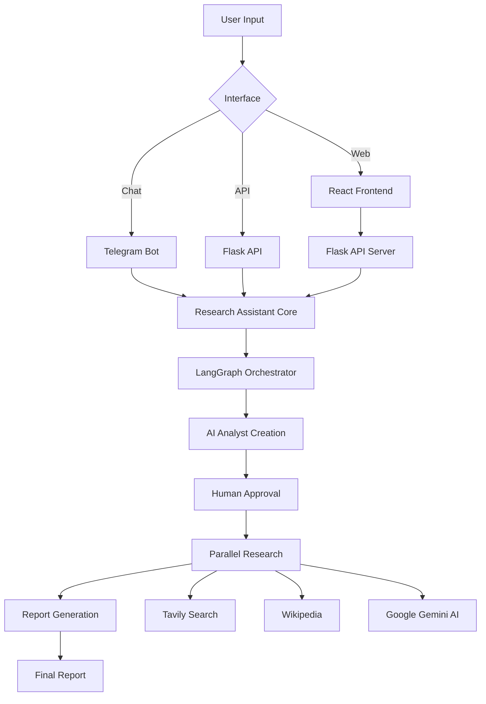

# 🔬 ResearchAgent-v0

<div align="center">


**An AI-powered research assistant that creates teams of AI analysts to conduct comprehensive research and generate detailed reports**

[🚀 Quick Start](#-quick-start) • [🕹️ Live: Research Agent](https://research-agent-v0.vercel.app/) • [🔧 Installation](#-installation)
</div>


---

## ✨ Features

- 🎯 **Multi-Analyst Research**: Creates specialized AI analyst teams for comprehensive topic coverage
- 🤖 **Human-in-the-Loop**: Review and approve analyst teams before research begins
- 📊 **Comprehensive Reports**: Generates detailed research reports with introduction, analysis, conclusion, and sources
- 🔄 **Multiple Interfaces**: Web UI, Telegram Bot, and API access
- 📱 **Modern UI**: Clean, responsive React-based web interface with PDF export
- ⚡ **Real-time Progress**: Live updates during research process
- 🔍 **Multi-Source Research**: Leverages Tavily Search, Wikipedia, and AI reasoning

## 🏗️ Architecture



### Core Components

- **🧠 Research Assistant Core** (`src/`): LangGraph-based orchestration engine
- **🌐 Web Frontend** (`frontend/`): Modern React application with Flask API
- **💬 Telegram Bot** (`src/telegram_bot.py`): Conversational research interface
- **🔌 API Interface** (`api/`): RESTful API for programmatic access

## 🚀 Quick Start

### Prerequisites

- **Python 3.8+** - [Download here](https://python.org/)
- **Node.js 14+** - [Download here](https://nodejs.org/)
- **API Keys**:
  - Google AI API key (for Gemini)
  - Tavily API key (for web search)
  - Telegram Bot Token (optional, for bot interface)

### 🎯 Web Interface (Recommended)

1. **Clone and setup:**
   ```bash
   git clone https://github.com/vijay-varadarajan/ResearchAgent-v0.git
   cd ResearchAgent-v0/frontend
   ```

2. **Automated setup:**
   ```bash
   # Windows
   setup.bat
   
   # Linux/Mac
   chmod +x setup.sh && ./setup.sh
   ```

3. **Configure environment:**
   Create `.env` file in `src/` directory:
   ```env
   GOOGLE_API_KEY=your_google_api_key
   TAVILY_API_KEY=your_tavily_api_key
   LANGSMITH_API_KEY=your_langsmith_api_key  # optional
   ```

4. **Start the application:**
   ```bash
   # Terminal 1: Backend API
   python api_server.py
   
   # Terminal 2: Frontend
   npm start
   ```

5. **Access the application:**
   - **Frontend**: http://localhost:3000
   - **API Health**: http://localhost:5000/api/health

### 💬 Telegram Bot

1. **Setup bot token:**
   Add to your `.env` file:
   ```env
   TELEGRAM_BOT_TOKEN=your_telegram_bot_token
   ```

2. **Run the bot:**
   ```bash
   cd src
   python run_bot.py
   ```

3. **Start chatting:**
   Find your bot on Telegram and send `/start`

## 📖 Documentation

### 🌐 Web Interface

The web interface provides a modern, chatbot-style experience:

1. **Enter Research Topic**: Type your research question or topic
2. **Review AI Analysts**: Approve or modify the generated analyst team
3. **Watch Progress**: Real-time updates during research
4. **Download Report**: Export as PDF when complete

**Key Features:**
- 🎯 Intuitive chat interface
- 👥 Analyst team customization
- 📊 Real-time progress tracking
- 📱 Responsive design (mobile-friendly)
- 📄 PDF export functionality

### 💬 Telegram Bot Commands

- `/start` - Welcome message and instructions
- `/new` - Start a new research project
- `/help` - Get help and documentation
- Send any message - Start research on that topic

### 🔌 API Endpoints

| Endpoint | Method | Description |
|----------|--------|-------------|
| `/api/health` | GET | Health check |
| `/api/research/start` | POST | Start new research session |
| `/api/research/approve` | POST | Approve analysts and begin research |
| `/api/research/modify` | POST | Modify analyst team |
| `/api/sessions` | GET | List active sessions |

**Example API Usage:**
```bash
# Start research
curl -X POST http://localhost:5000/api/research/start \
  -H "Content-Type: application/json" \
  -d '{"topic": "Artificial Intelligence in Healthcare", "max_analysts": 3}'

# Approve analysts
curl -X POST http://localhost:5000/api/research/approve \
  -H "Content-Type: application/json" \
  -d '{"session_id": "your_session_id"}'
```

## 🛠️ Installation

### Manual Installation

1. **Clone repository:**
   ```bash
   git clone https://github.com/vijay-varadarajan/ResearchAgent-v0.git
   cd ResearchAgent-v0
   ```

2. **Install backend dependencies:**
   ```bash
   pip install -r requirements.txt
   ```

3. **Install frontend dependencies:**
   ```bash
   cd frontend
   npm install
   ```

4. **Configure environment variables:**
   Create `.env` file in `src/` directory with your API keys

5. **Test installation:**
   ```bash
   # Test API
   cd frontend
   python test_api.py
   
   # Test core functionality
   cd ../src
   python test_graph.py
   ```

### 🐳 Docker Deployment

```bash
# Build and run with Docker
docker build -t research-agent .
docker run -p 5000:5000 --env-file .env research-agent
```

### ☁️ Cloud Deployment

The application is configured for deployment on:
- **Vercel** (Frontend)
- **Render/Railway** (Backend API)
- **Heroku** (Full stack)

See deployment-specific configuration in:
- `frontend/package.json` - Frontend build configuration
- `requirements.txt` - Production dependencies
- `start.sh` - Deployment startup script

## 📁 Project Structure

```
ResearchAgent-v0/
├── 📁 src/                          # Core research engine
│   ├── 🧠 research_assistant.py     # Main LangGraph orchestrator
│   ├── 📋 schema.py                 # Data models and types
│   ├── 💬 telegram_bot.py           # Telegram interface
│   ├── 🚀 run_bot.py               # Bot runner script
│   └── 🧪 test_*.py                # Test utilities
├── 📁 frontend/                     # Web application
│   ├── 📁 src/                     # React components
│   │   ├── ⚛️ App.js               # Main application
│   │   ├── 🎨 index.css            # Styles
│   │   └── ⚙️ config.js            # Configuration
│   ├── 🌐 api_server.py            # Flask API server
│   ├── 📄 README.md               # Frontend documentation
│   ├── 📦 package.json            # Dependencies
│   └── 🛠️ setup.sh/.bat           # Setup scripts
├── 📁 api/                         # API deployment
│   └── 🔌 index.py                # API endpoint
├── 📄 requirements.txt             # Python dependencies
├── 🚀 start.sh                    # Startup script
└── 📖 README.md                   # This file
```

## 🔧 Configuration

### Environment Variables

Create a `.env` file in the `src/` directory:

```env
# Required - Google AI (Gemini)
GOOGLE_API_KEY=your_google_ai_api_key

# Required - Web Search
TAVILY_API_KEY=your_tavily_api_key

# Optional - Telegram Bot
TELEGRAM_BOT_TOKEN=your_telegram_bot_token

# Optional - LangSmith Tracing
LANGSMITH_API_KEY=your_langsmith_api_key
LANGCHAIN_TRACING_V2=true
LANGCHAIN_PROJECT=research-assistant

# Optional - Production Settings
FLASK_ENV=production
PORT=5000
```

### Getting API Keys

1. **Google AI API**: 
   - Visit [Google AI Studio](https://aistudio.google.com/)
   - Create a new API key
   - Enable the Generative AI API

2. **Tavily API**:
   - Sign up at [Tavily](https://tavily.com/)
   - Get your API key from the dashboard

3. **Telegram Bot** (optional):
   - Message [@BotFather](https://t.me/botfather) on Telegram
   - Create a new bot and get the token

## 🎯 Usage Examples

### Research Examples

**Academic Research:**
```
"Latest developments in quantum computing and their applications"
```

**Business Analysis:**
```
"Market trends in renewable energy sector 2024"
```

**Technology Review:**
```
"Comparison of large language models: GPT-4 vs Claude vs Gemini"
```

**Health & Medicine:**
```
"Recent advances in CRISPR gene editing technology"
```

### Customizing Analyst Teams

When the system creates analyst teams, you can:
- ✅ **Approve** the suggested team
- ✏️ **Modify** with feedback like:
  - "Add a financial analyst perspective"
  - "Focus more on technical implementation"
  - "Include regulatory and ethical considerations"
  - "Remove the [specific role] and add [new role]"

## 🧪 Testing

### Run Tests

```bash
# Test API functionality
cd frontend
python test_api.py

# Test core research functionality  
cd ../src
python test_graph.py

# Test report splitting (for Telegram)
python test_splitting.py
```

### Health Checks

```bash
# Check API health
curl http://localhost:5000/api/health

# Check active sessions
curl http://localhost:5000/api/sessions
```

## 🤝 Contributing

We welcome contributions! Here's how to get started:

1. **Fork the repository**
2. **Create a feature branch**: `git checkout -b feature-name`
3. **Make your changes** and test thoroughly
4. **Commit changes**: `git commit -m "Add feature"`
5. **Push to branch**: `git push origin feature-name`
6. **Submit a pull request**

### Development Guidelines

- 🧪 Add tests for new features
- 📝 Update documentation
- 🎨 Follow existing code style
- ✅ Ensure all tests pass
- 📱 Test on multiple interfaces (Web, Telegram, API)

## 🐛 Troubleshooting

### Common Issues

**"Module not found" errors:**
```bash
# Ensure all dependencies are installed
pip install -r requirements.txt
cd frontend && npm install
```

**API connection issues:**
```bash
# Check if API server is running
curl http://localhost:5000/api/health

# Verify environment variables
echo $GOOGLE_API_KEY
```

**Telegram bot not responding:**
```bash
# Check bot token in .env file
# Ensure bot is running: python run_bot.py
# Verify webhook settings if using webhooks
```

**Frontend build issues:**
```bash
# Clear cache and reinstall
cd frontend
rm -rf node_modules package-lock.json
npm install
npm start
```

### Getting Help

- 📧 **Issues**: Open an issue on GitHub
- 💬 **Discussions**: Use GitHub Discussions
- 📖 **Documentation**: Check the frontend README for detailed setup

## 📜 License

This project is licensed under the MIT License. See [LICENSE](LICENSE) file for details.

## 🙏 Acknowledgments

- **LangChain & LangGraph** - AI orchestration framework
- **Google AI** - Gemini language model
- **Tavily** - Web search API
- **React** - Frontend framework
- **Flask** - Backend API framework

---

<div align="center">

**⭐ If you find this project useful, please give it a star! ⭐**

[Report Bug](https://github.com/vijay-varadarajan/ResearchAgent-v0/issues) • [Request Feature](https://github.com/vijay-varadarajan/ResearchAgent-v0/issues) • [Documentation](https://github.com/vijay-varadarajan/ResearchAgent-v0/wiki)

</div>
